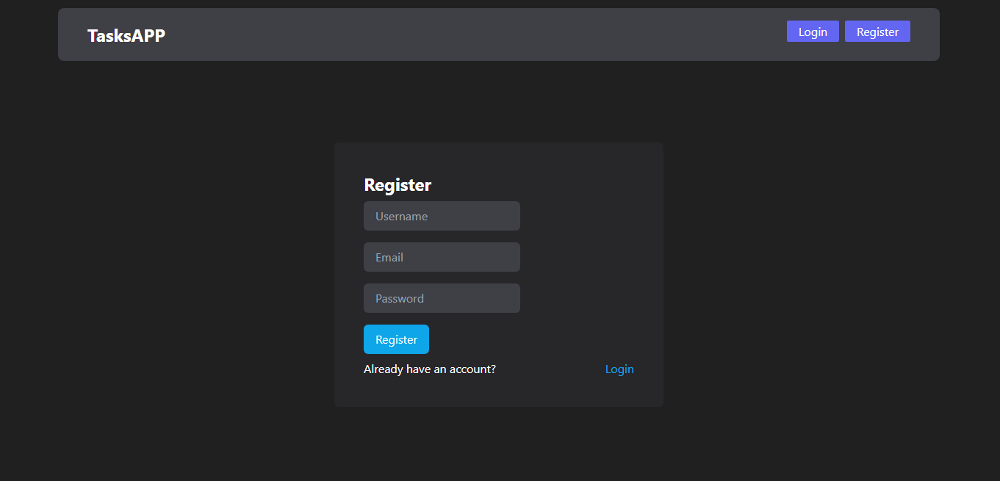

# Tasks-app

## Tecnologías Utilizadas

+ Node.js
+ Express
+ MongoDB
+ React
+ JavaScript
+ HTML
+ Tailwindcss
+ Vite

## Descripción

Esta app te permite crear, guardar, editar y eliminar tareas. Con su respectivo título, descripción y fecha. Para ello debes registrarte con un usuario, email y contraseña. Luego te logueas con los datos registrados y ahi empiezas a cargar tus tareas.

## Como se ve Tasks-app

+ ### Home Page

+ ### Register

+ ### Login

+ ### Add task

+ ### Tasks 

